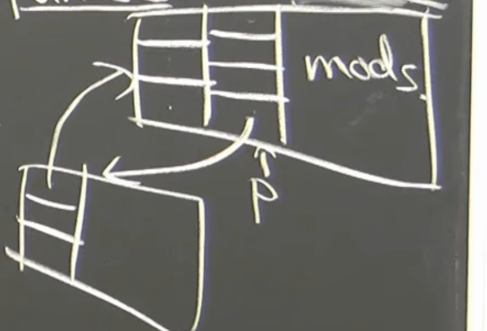
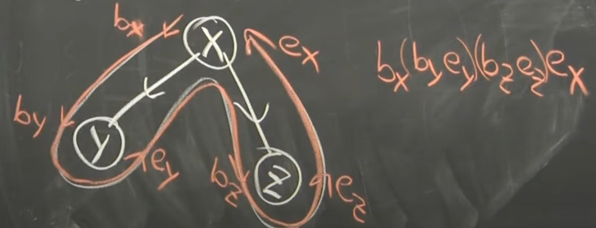

## Temporal Data Structure

- Persistence Data Structure
-  Retroactivity


### Persistence data structure
* If you want to update in the data structure you should copy all the old variants , new change in the structure will create a new branch , old things will be stored and not get modified
    * Keep all version of the structure.
    * update in the data structure will return the new version of the that DS

**Four level of persistence**
1. Partial persistence 
    - Only aloowed to update the latest version
    - Divergence are linearly order
    - 
2. Full Persistence model
    - We can update any model 
    - version will create a lot of branches....(branching universe model  *LOL*)
3. Cofluent persistence 
    - Combine two version branches to create a new version[We can converge two data strcuture like : LL , binary tree etc...]
    - Now this will create a DAG(directed acyclic graphs) 
    
4. Functional model
    - Can never modify the structure
    - only make new nodes


# Partial Persistence
* Any pointer machine data structure with ```p = O(1)``` pointers to any node can be made partially persistence with O(1) amertised overhead and O(1) space or change in the data structure.

**PROOF** 

1. Store back pointer

mods === [version , field , value]
2. To read node + field at version V
    - So what are the changes happen till V ? -> we will look all the field and mods 
3. To modify node.field = x (setting a new field)
    - If the node is not full : add mod
    (now , field , x ). -> now means we are looking at this time(current time)
    - else : Make a new node node_prime , where all these modification applied (initially mod will be empty)
    - update (recursively update the field pointer)
    
# Amortized Analysis

## Definition
The average time taken per operation over a sequence of operations, even if individual operations may vary greatly in cost.

## Purpose
To give a more realistic measure of performance for data structures where occasional expensive operations are offset by many cheap ones.

---

## Methods of Amortized Analysis
1. **Aggregate Method** – Find the total cost of `n` operations, divide by `n`.
2. **Accounting Method** – Assign fictitious "credits" to operations to balance future costs.
3. **Potential Method** – Use a mathematical potential function to store and release "energy" for operations.

---

## Potential Method

### Idea
Associate a non-negative **potential function** `Φ(D)` with the current state `D` of the data structure.  
The potential represents **stored work/credit** that can pay for future costly operations.  
Over time, this allows expensive operations to be "paid for" by cheaper ones.

---

### Formula
If:
- `cᵢ` = actual cost of the *i-th* operation  
- `Φ(Dᵢ)` = potential after the *i-th* operation  
- `Φ(Dᵢ₋₁)` = potential before the *i-th* operation  

Then the **amortized cost** is:


Where:
- `Φ(Dᵢ) - Φ(Dᵢ₋₁) > 0` → saving up credit.  
- `Φ(Dᵢ) - Φ(Dᵢ₋₁) < 0` → spending stored credit.  

---

### Conditions
- `Φ(D) ≥ 0` for all states `D` (potential can't be negative).  
- Initial potential `Φ(D₀)` should ideally be `0`.

---

### Example — Dynamic Array Insertion
- **Data Structure:** Array that doubles capacity when full.
- **Actual Costs:**
  - Normal insert → `O(1)`
  - Resize → `O(n)` (copy all elements)
- **Potential Function:**  
- **Result:** Amortized insertion cost = `O(1)` even though some insertions cost `O(n)`.

---

## Use Cases in Advanced Data Structures
- **Union-Find with Path Compression** → Amortized `O(α(n))`
- **Fibonacci Heap** → Amortized `O(1)` for `Decrease-Key`
- **Splay Trees** → Amortized `O(log n)` per operation


## Why Recursion Matters
Many advanced data structures have recursive operations:
- **Union-Find with Path Compression** → recursive `find()` calls
- **Splay Trees** → recursive search with rotations
- **AVL / Red-Black Trees** → rebalancing via recursive insert/delete
- **Segment Trees / Treaps** → recursive divide-and-conquer operations

**Key observation:**  
- Recursive operations can occasionally be **very expensive** (deep calls, cascading updates).
- These expensive calls often *reduce future costs* by restructuring the data.
- The **Potential Method** accounts for these future savings.

---

## How Recursion Fits in the Potential Method
For an operation with recursion:

### 1. Actual Cost (`cᵢ`)
- Includes **all recursive calls** made during the operation.
- Example: A recursive search down a tree followed by rebalancing on the way back up.

### 2. Potential Change (`Φ(Dᵢ) - Φ(Dᵢ₋₁)`)
- Recursive calls often **shorten paths**, **balance trees**, or **reduce future recursion depth**.
- This decreases the potential, meaning we "spend credit" to pay for a large cost now.
- Sometimes recursion increases potential (e.g., temporary imbalance), which means we are "saving credit" for future fixes.

### 3. Amortized Cost Formula- Recursion impacts `cᵢ` directly and changes the state-dependent potential values.

```ĉᵢ = cᵢ + Φ(Dᵢ) - Φ(Dᵢ₋₁)```
Where:
- `ĉᵢ` → **Amortized cost** of the *i-th* operation  
- `cᵢ` → **Actual cost** of the *i-th* operation  
- `Φ(Dᵢ)` → **Potential** after the *i-th* operation  
- `Φ(Dᵢ₋₁)` → **Potential** before the *i-th* operation  

---

## Meaning
- The amortized cost is the **actual cost** plus the **net change in potential**.
- **Potential** acts like "stored credit" that can pay for future expensive operations.

---

## Interpretation
1. If `Φ(Dᵢ) > Φ(Dᵢ₋₁)` →  
   - Potential increases → we **save credit** for the future.  
   - Amortized cost is slightly more than the actual cost.

2. If `Φ(Dᵢ) < Φ(Dᵢ₋₁)` →  
   - Potential decreases → we **spend saved credit** to pay for this expensive step.  
   - Amortized cost can be *less* than the actual cost.

---

## Why This Works
Over a sequence of operations:
- The total amortized cost ≥ total actual cost (if initial potential ≥ 0 and final potential ≥ 0).
- This gives a **smoothed-out average** that hides occasional spikes in actual cost.


---

## Example — Union-Find with Path Compression
```cpp
int find(int x) {
    if (parent[x] != x) 
        parent[x] = find(parent[x]);  // recursion
    return parent[x];
}
```
# Full Persistence
   - You can access all past versions.
   - You can update **any version**, creating a new branch of versions.
   - Essentially, the versions form a **version tree** instead of a single timeline.

- **mods(x)** tracks changes without making a new node.
- **back pointer** links copied nodes to their source for historical traversal.
- Space and time efficiency depend on limiting `mods(x)` and sharing unchanged structure.

* Linearise the tree of vertices

* Maintain begin and end of the each version ( string defined from bx to ex represet all)
* USE ```Order maintainence data structure```
```
    A node           B node          C node         
   +--------+      +--------+      +--------+      +------+
   |  data  |  →   | data   |  →   | data   |  →   | NULL |
   |  next  |      |  next  |      |  next  |      |      |
   +--------+      +--------+      +--------+      +------+
   ```

   * In ```Order maintainence data structure``` we can some how find ```if C > A ? or not ``` in ```O(1)``` LOL!! (Will see later)

mods === [version , field , value]
1. To read node + field at version V
    - So what are the changes happen till V ? -> we will look all the field and mods 
2. To modify node.field = x (setting a new field)
    - If the node is not full : add mod 
    - Split node into 2 halve(split tree)
    - Apply mods to new node

# Confluent Persistence

## Definition
Confluent persistence is a type of **persistent data structure** that allows:
1. **Access to all past versions** (like full persistence)
2. **Updates to any version** (branching)
3. **Merging two versions** into a single new version (**confluence**)

In other words:
- **Full persistence** → versions form a **tree**
- **Confluent persistence** → versions form a **Directed Acyclic Graph (DAG)**  
  (because merging creates edges between branches)

---

## Key Points
- **Merging** combines the states of two distinct versions into a new one.
- Confluent operations are only valid if they do not introduce cycles in the version history (hence a DAG).
- Used when you need **parallel version evolution** with later integration.

---

## Example Use Case
- **Version control systems** (e.g., Git merges branches)
- **Collaborative editors** (merge two users' edit histories)
- **Branch-and-merge algorithms** in computational geometry or simulations

---

## Representation
1. **Version Graph:**  
   - Nodes = versions
   - Edges = derivation from earlier versions
   - Merge operation creates a node with **two parents**

2. **Data Sharing:**  
   - Structure can share unchanged substructures between versions to save space.
   - Changes only copy affected nodes (like path copying or fat node methods).

---

## Diagram
```
v0
|
v1
/
v2 v3
\ /
v4 <- merge(v2, v3)
```


- `v4` is a confluent merge of `v2` and `v3`.
- The version graph is **not a tree** but a **DAG**.

---

## Basic Operation Costs

Let:
- **F** = number of fields per node
- **mods(x)** = modifications stored in node `x`
- **u** = number of updates
- **m** = number of merges
- **k** = maximum mods per node before copying

**Space:**
O(N * F + u + m)1

pgsql
Copy
Edit
(Nodes + modifications + merge-related changes)

**Time:**
- **Read**: O(log mods(x)) for a field in a given version
- **Update**: O(1) amortized (if mods < k) or O(F) when copying
- **Merge**: O(size of merged parts) + pointer adjustments

- **Merge conflicts:** How to combine values of the same field from two versions.(avg git behavious)
- **Cycle prevention:** Merges must ensure the version graph remains acyclic.
- **Space complexity:** Merges can cause duplication if structures differ significantly.

## Practical Notes
- Merging often requires **custom conflict resolution** (similar to Git merge strategies).
- Efficient merges rely on **immutable data sharing** — if two versions share unchanged parts, they point to the same memory.
- Data structures like **balanced binary trees** or **skip lists** adapt well to confluent persistence.

---

## When to Use Confluent Persistence
- You need **full persistence** features **plus merging**.
- Multiple branches of computation or edits must converge into one state.
- Memory efficiency is critical and you can leverage structure sharing.

# Functional Model of Persistence

## Definition
The **Functional Model** (also called **Purely Functional Data Structure**) is the strongest form of persistence where:
- **No modification** is ever made to an existing structure.
- Every "update" creates a **new version**.
- All old versions are **permanently preserved** and accessible.

This ensures **immutability** — once a version is created, it can never be changed.
1. **Immutability**: Data is read-only after creation.
2. **Persistence by default**: All operations that "change" the structure return a new version.
3. **Structure sharing**: Unchanged parts of the structure are shared between versions to save memory.
4. **Mathematical purity**: Behavior is deterministic — same inputs always give the same outputs.

---

## Example
```plaintext
Version v0: [1, 2, 3]
Insert 4 → Version v1: [1, 2, 3, 4]
Insert 5 into v0 → Version v2: [1, 2, 3, 5]

    v0
   /  \
  v1  v2
```
### Advantages

* Thread-safe (no race conditions)
* Easy rollback (keep old version reference)
* Built-in persistence without extra mechanisms
* Ideal for functional programming languages (Haskell, Clojure, OCaml)

### Disadvantages

* Potentially higher memory usage compared to mutable structures
* Slightly higher constant factors in execution time
* No in-place updates possible


---
---
---
---
---
---
---
---
---
---
---
---
---
---
---


# Summary

## 1. Partial Persistence
**Definition:**  
A data structure is *partially persistent* if all historical versions are accessible for queries, but **updates** are allowed **only on the latest version**.

**Key Properties:**
- **Version Graph:** Directed path (linear order).
- **Allowed Ops:**  
  - Read(v, query) — any version `v`
  - Update(latest, op) — only latest version
- **Invariants:**  
  - Versions form a total order: `v₀ < v₁ < ... < vₙ`
  - No backward branching.
- **Implementation Insight:**  
  - Store *modification records* (mods) per node.
  - Maintain back pointers for space-sharing unchanged parts.
- **Complexity:**  
  - Pointer machine DS with `p = O(1)` pointers/node can be made partially persistent in **O(1) amortized time** and **O(1) space per update**.

**Version Graph:**

```v0 → v1 → v2 → v3 → ...```
---

## 2. Full Persistence
**Definition:**  
A data structure is *fully persistent* if all historical versions are accessible **and** updates are allowed on **any version**, creating **branching timelines**.

**Key Properties:**
- **Version Graph:** Rooted **tree** (each version has exactly one parent; branching allowed).
- **Allowed Ops:**
  - Read(v, query) — any version
  - Update(v, op) — create new version as child of `v`
- **Invariants:**
  - Versions form a partial order (tree structure).
  - No merging of branches.
- **Implementation Insight:**
  - Extends partial persistence via *fat nodes* or *path copying*.
  - Updating an internal node triggers recursive parent updates via back pointers.
- **Complexity:**
  - Fat-node method: `O(1)` amortized per modification until mod array is full.
  - Path copying: `O(log n)` to copy affected path.

**Version Graph:**
```
 v0
/  \
v1 v2
| /
v3 v4 v5
```

---

## 3. Confluent Persistence
**Definition:**  
A data structure is *confluently persistent* if it supports **reading** from any version, **updating** any version, and **merging** two or more versions to produce a new one.

**Key Properties:**
- **Version Graph:** Directed Acyclic Graph (**DAG**), not necessarily a tree.
- **Allowed Ops:**
  - Read(v, query)
  - Update(v, op)
  - Merge(v₁, v₂) → new version combining structures.
- **Invariants:**
  - No cycles — merging must preserve acyclicity of the version graph.
  - Merge semantics depend on DS type (must be well-defined).
- **Implementation Insight:**
  - Must handle structural sharing across multiple parents.
  - Memory management complexity increases (reference counting / GC).
- **Complexity:**
  - Merge cost depends on DS — often `O(size_of_merge)` unless specialized merging algorithms are used.


---

## 3. Confluent Persistence
**Definition:**  
A data structure is *confluently persistent* if it supports **reading** from any version, **updating** any version, and **merging** two or more versions to produce a new one.

**Key Properties:**
- **Version Graph:** Directed Acyclic Graph (**DAG**), not necessarily a tree.
- **Allowed Ops:**
  - Read(v, query)
  - Update(v, op)
  - Merge(v₁, v₂) → new version combining structures.
- **Invariants:**
  - No cycles — merging must preserve acyclicity of the version graph.
  - Merge semantics depend on DS type (must be well-defined).
- **Implementation Insight:**
  - Must handle structural sharing across multiple parents.
  - Memory management complexity increases (reference counting / GC).
- **Complexity:**
  - Merge cost depends on DS — often `O(size_of_merge)` unless specialized merging algorithms are used.


## Comparative Summary

| Model                  | Version Graph Type | Read Old Versions | Update Old Versions | Merge Versions | Typical Use Case | Complexity Notes |
|------------------------|--------------------|-------------------|---------------------|----------------|------------------|------------------|
| **Partial**            | Path (linear)      | Y                 | N                  | N              | Time travel in logs | O(1) amortized per update |
| **Full**               | Tree               | Y                 | Y                  | N              | Branching histories | O(1)–O(log n) depending on method |
| **Confluent**          | DAG                | Y                 | Y                  | Y              | Collaborative merges | Often O(size_of_merge) |
| **Functional**         | Tree/DAG (immutable)| Y                | Y (via new version)| N              | Purely functional DS | O(log n) with sharing |

---

## Key Complexity References
- Driscoll, Sarnak, Sleator, Tarjan — *"Making Data Structures Persistent"* (1989)
- Partial → O(1) amortized  
- Full → O(1)–O(log n) (fat nodes vs path copying)  
- Confluent → varies widely; merge is often bottleneck  
- Functional → O(log n) for updates in balanced trees
---
---
---
---
---
---
---
---
---
---
---
---
---
---
---

# Porject ideas
1. Implement a linked list with partial persistence using the *modification box* (mods) method.
2. Implement a BST (or AVL / Red-Black Tree) that allows updates to any version without destroying old versions.
3. Create a graph data structure where you can:
    - Branch versions
    - Merge versions to form a DAG of versions
4. Persistent Undo/Redo Text Editor

 